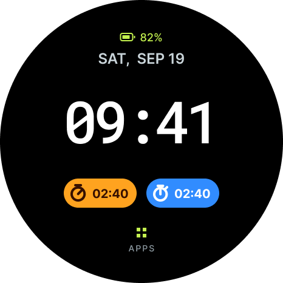
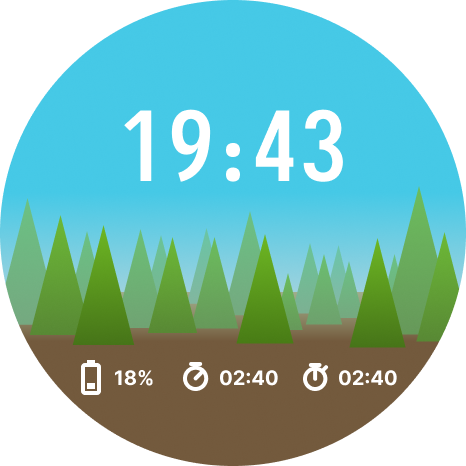
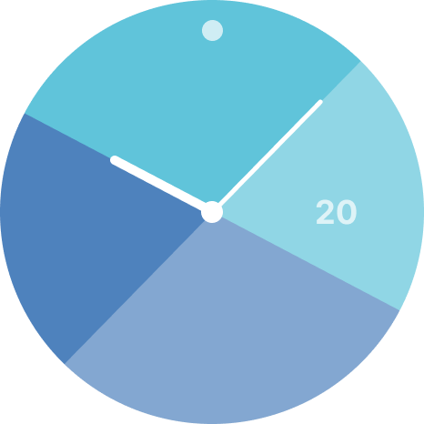

# M5StopWatch wararyoLauncher

M5StopWatch 用の、軽くて電池の持つ時計型ランチャーです。  
標準の UserDemo の代替を目指しているほか、[M5StopWatch-MultiFirm](https://github.com/wararyo/M5StopWatch-MultiFirm) のホストとして、他のファームウェアを最大3つまで共存させ起動する機能も有しています。

> [!NOTE]
> An English UI build is available: build with `pio run -e m5stopwatch-en` and install `.pio/build/m5stopwatch-en/firmware.bin` in place of `m5stopwatch` in the steps below.
> 英語表示版は `m5stopwatch-en` 環境でビルドできます。

<table>
  <tr>
    <td></td>
    <td></td>
    <td></td>
    <td></td>
  </tr>
  <tr>
    <td align="center">Digital</td>
    <td align="center">Forest</td>
    <td align="center">Analog</td>
    <td align="center">Noonish</td>
  </tr>
</table>

## 特徴

- **省バッテリー** — 画面消灯中の消費電力は推定20mWで、これは約3日持つ計算です。
- **軽快な描画** — LVGL を使わず M5GFX を用いて描画を最適化することで、ある程度滑らかな描画を実現しています。
- **4種類の文字盤** — Digital・Forest・Analog・Noonish を用意しており、容易に拡張できる設計です。
- **手首を上げると点灯** — 消灯中は手首を上げる動作、ボタン、タッチのいずれかで復帰できます。
- **外部アプリを一覧から起動** — MultiFirm で `ota_1`〜`ota_3` に入れたファームウェアを、名前つきで一覧に並べて直接起動できます。
- **内蔵アプリ** — ストップウォッチ・タイマー・歩数計を内蔵しており、容易に拡張できる設計です。
- **無線を使わない** — Wi-Fi も Bluetooth も使わないことで低消費電力を実現しています。

### 基本操作

| 操作 | 動作 |
|---|---|
| 時計で上へスワイプ、または A / B | アプリ一覧を開く |
| アプリ一覧で A / B | 次の項目へ / 決定（項目のタップでも起動） |
| アプリ一覧の先頭で下へ引く | 時計へ戻る |
| 時計を長押し | 時計表示の切り替え(内容はWatchFaceにより異なります) |
| A+B を0.6秒長押し | 時計へ戻る |

## 導入方法

ランチャーは MultiFirm の**ホスト**として `ota_0` に入ります。
書き込みは MultiFirm の PC ツール（Windows は `multifirm.ps1`、macOS / Linux は `multifirm.sh`）を使って実施してください。

よく分からない場合は、お手持ちのAIエージェントに聞くのが無難です。

> [!IMPORTANT]
> `pio run -t upload` などの通常の書き込みは、MultiFirm の配置を壊さないよう拒否する設定にしています。
> 書き込みには必ず MultiFirm のツールを使ってください。

### 必要なもの

- M5StopWatch 本体と USB ケーブル
- [PlatformIO Core](https://docs.platformio.org/en/latest/core/installation/index.html)、Git、Python 3.11

### 1. 取得とビルド

ランチャーと MultiFirm（v1.1.0）を同じフォルダに並べて取得し、ランチャーをビルドします。

```sh
git clone --branch v1.1.0 https://github.com/wararyo/M5StopWatch-MultiFirm.git
git clone https://github.com/wararyo/M5StopWatch-wararyoLauncher.git
cd M5StopWatch-wararyoLauncher
pio run -e m5stopwatch
```

成果物は `.pio/build/m5stopwatch/firmware.bin` です。
英語表示版は `pio run -e m5stopwatch-en` でビルドし、以降の手順の `m5stopwatch` を `m5stopwatch-en` に読み替えます。

### 2. MultiFirm ツールの準備

MultiFirmはPythonとesptoolを使用します。
Python 3.11 と esptool 4.12.0 で動作確認済みです。

まずMultiFirm 側に専用の仮想環境を作ります。

Windows（PowerShell）:

```powershell
py -3.11 -m venv ..\M5StopWatch-MultiFirm\tools\.venv
..\M5StopWatch-MultiFirm\tools\.venv\Scripts\python.exe -m pip install -r ..\M5StopWatch-MultiFirm\tools\requirements.txt
```

macOS / Linux:

```sh
python3 -m venv ../M5StopWatch-MultiFirm/tools/.venv
../M5StopWatch-MultiFirm/tools/.venv/bin/python -m pip install -r ../M5StopWatch-MultiFirm/tools/requirements.txt
```

以下のコマンドは Windows の書き方です。macOS / Linux では `multifirm.ps1` を `multifirm.sh` に、`\` を `/` に、
`COM11` を本体のポート（macOS は `/dev/cu.usbmodem*`、Linux は `/dev/ttyACM*`）に読み替えてください。
Windows のポート番号はデバイスマネージャーの「ポート (COM と LPT)」で確認できます。
PowerShell がスクリプトの実行を拒否する場合は、先に `Set-ExecutionPolicy -Scope Process Bypass` を実行してください（そのウィンドウの間だけ有効です）。

書き込む前にシリアルモニターは閉じておきます。ツールが本体に接続するときは、読み取りだけでも本体がリセットされます。

### 3. 本体の状態を確かめる

```powershell
..\M5StopWatch-MultiFirm\tools\multifirm.ps1 status --port COM11
```

`パーティション表: multifirm-v1` と出れば、MultiFirm 導入済みです（4-B へ）。
それ以外（購入時のままなど）なら 4-A へ進みます。

### 4-A. 初めて導入する

本体を MultiFirm の配置にし、ランチャーをホストとして書き込みます。
`--check-device` は本体を読み取って確認するだけで、`--execute` で実際に書き込みます。

```powershell
..\M5StopWatch-MultiFirm\tools\multifirm.ps1 initial --host-build .pio\build\m5stopwatch --port COM11 --check-device
..\M5StopWatch-MultiFirm\tools\multifirm.ps1 initial --host-build .pio\build\m5stopwatch --port COM11 --execute
```

> [!WARNING]
> 初回導入では、本体の設定（NVS）、Bluetooth のペアリング情報、入っていたアプリが消えます。
> 書き込み前に 16MiB 全体のバックアップを `..\M5StopWatch-MultiFirm\.multifirm\backups\` へ自動で保存します。
> バックアップにはペアリングの鍵が含まれるので、他人と共有しないでください。

### 4-B. ランチャーを更新する（MultiFirm 導入済み）

`ota_0` だけを書き換えます。ゲストと設定は残ります。UserDemo など別のホストからの置き換えもこの手順です。

```powershell
..\M5StopWatch-MultiFirm\tools\multifirm.ps1 install-host .pio\build\m5stopwatch\firmware.bin --port COM11 --check-device
..\M5StopWatch-MultiFirm\tools\multifirm.ps1 install-host .pio\build\m5stopwatch\firmware.bin --port COM11 --execute
```

更新前に選んでいたゲストが起動した場合は、ゲストの戻る操作か、下の `recover` でランチャーへ戻ってください。

### 5. 外部アプリ（ゲスト）を入れる

ゲストは `ota_1`〜`ota_3` のどれかに書き込みます。標準のビルドのまま入れられます（1スロット 2,031,616 bytes まで）。
`--name` に指定した名前がランチャーの一覧に表示されます。

```powershell
..\M5StopWatch-MultiFirm\tools\multifirm.ps1 install --slot 1 <ゲストの firmware.bin> --name "MyApp" --port COM11 --execute
```

ゲストからランチャーへ戻るには、ゲストに MultiFirm のゲストライブラリを組み込む必要があります。
組み込み方は [MultiFirm の README](https://github.com/wararyo/M5StopWatch-MultiFirm/tree/v1.1.0) を参照してください。

### 困ったとき

- **ゲストから戻れない** — `multifirm.ps1 recover --port COM11 --execute` で、次の起動からランチャーが立ち上がります。
- **書き込みが途中で失敗した** — 同じコマンドを再実行するか、バックアップから復元します。
- 各コマンドの詳細と復元手順は [MultiFirm ツールの説明](https://github.com/wararyo/M5StopWatch-MultiFirm/blob/v1.1.0/tools/README.md) にあります。

## 開発

全体の構造、内蔵アプリや文字盤の追加方法は [docs/architecture.md](docs/architecture.md) にまとめています。

| 目的 | コマンド |
|---|---|
| 製品ビルド | `pio run -e m5stopwatch`（英語表示版は `-e m5stopwatch-en`） |
| PC 上のテスト | `python tools/test_runtime.py`（日本語版・英語版の両方で実行。g++ が必要。Windows では MSYS2 UCRT64 の GCC） |
| ビルド条件・パーティションの検証 | `python tools/verify_build.py`（本体には接続しない） |

描画性能・ピクセル比較・電池駆動の記録など、検証用のビルド環境は [architecture.md の8章](docs/architecture.md#8-変更後の確認と調査の入口) を参照してください。

一覧のアイコンは `icons/*.png`（44×44のグレースケールマスク）から `python tools/build_icons.py` で
`src/assets/AppIcons.bin` を作ります。アイコンを差し替えたときだけ実行し直します。

日本語表示には源真ゴシック 28px の部分集合を埋め込んでいます。TrueType フォントはリポジトリに含めないため、
フォントや文字集合を変えたときは `pip install freetype-py` のうえ
`python tools/build_font.py --source <GenShinGothic-Medium.ttf>` で作り直します。
埋め込みフォントは SIL Open Font License 1.1 で、ライセンス文を [src/ui/graphics/fonts/](src/ui/graphics/fonts/) に置いています。

## リポジトリの構成

| 場所 | 内容 |
|---|---|
| `src/`、`platformio.ini` | ファームウェア本体 |
| `tests/`、`tools/` | PC 上のテスト、ビルド検証、書き込み保護、資産の生成・測定用スクリプト |
| `icons/` | アプリ一覧アイコンの原本 |
| [docs/architecture.md](docs/architecture.md) | 全体構成、機能の追加方法、差分描画、省電力の仕組み |
| [docs/plan.md](docs/plan.md) | 製品版の設計書・要件 |
| [docs/measurements.md](docs/measurements.md) | 実機測定の結果と、踏んだ罠の記録 |
| `docs/task*/` | 開発時の計画と検証記録 |
| `measurement/` | 描画性能と消費電力を測るための試作（製品版とは別構成。[measurement/README.md](measurement/README.md)） |

## 既知の不具合

### USB接続中に画面が復帰しない
画面OFF時にパネルを明示的にスリープさせるようにしていることが原因と推測されます。
M5StopWatchでUSB接続中にパネルをスリープさせると、それ以降パネルを正しくスリープから復帰できない問題が確認されています。
M5GFXのsetSleep()はただ単に画面の輝度を0にする実装となっているのですが、おそらくこの問題を回避するためにそのような実装を採用していると推測されます。
wararyoLauncherではUSB接続中の安定性より省バッテリー性を優先し、明示的にパネルをスリープさせています。
