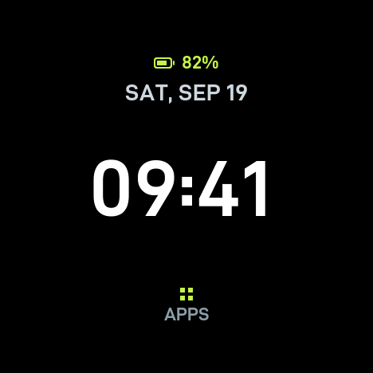
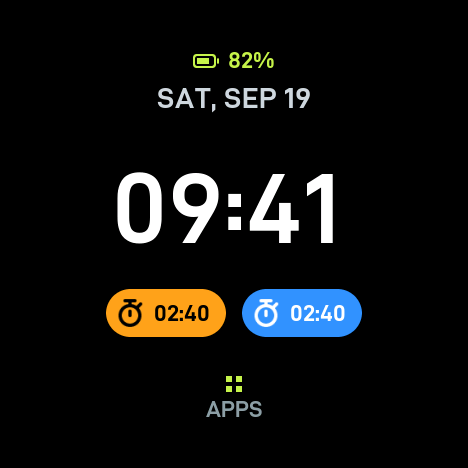
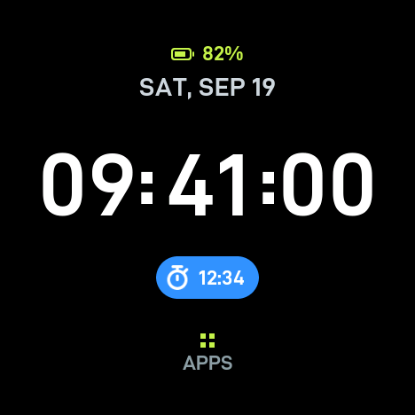
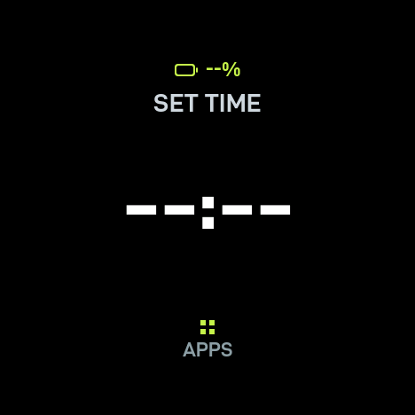
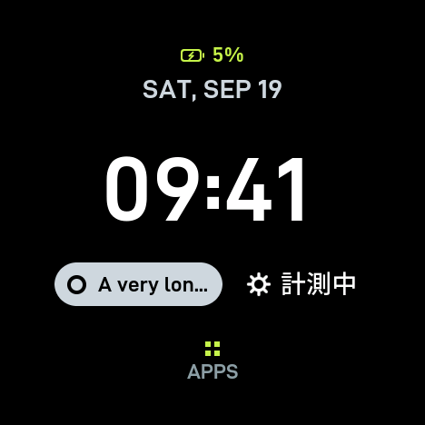
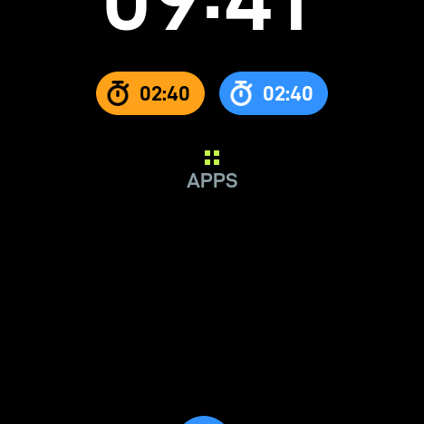

# 10-3 検証記録: Digitalのフォントと情報欄

実施日: 2026-09-26。[10-3計画](plan-10-3.md)の実装、ホスト検証、ビルド、実機の描画検証・描画時間の測定、ユーザーによる目視確認を終え、**10-3を完了とした**。

見た目は実機の画面を読み戻した画像で確認できる（[10-3-shots](10-3-shots/)。作り方は5節）。
2026-09-26、ユーザーの確認を受けて名称と位置を調整した（1節の「調整」）。画像・数値は調整後のもの。

| 情報なし | 情報2件 | 秒表示＋情報1件 |
|---|---|---|
|  |  |  |
| **無効時刻・電池不明** | **長いラベル・日本語・黒の推奨色・充電中5%** | **一覧遷移の途中** |
|  |  |  |

## 1. 実装の要点

| 場所 | 内容 |
|---|---|
| `tools/build_font.py` | `--output`・`--chars-file`を追加。省略時は従来どおり日本語資産。収録文字は`tools/fonts/time.txt`・`ascii.txt` |
| `src/ui/graphics/fonts/` | D-DIN-PROの4資産と`OFL-D-DIN-PRO.txt`。日本語資産を再生成（10-0所見1の解消）。生成手順・ハッシュは[フォント記録](fonts.md)6節 |
| `src/ui/graphics/WatchFonts.*` | 文字盤共用の28px・22pxフォント、時刻用のグリフ集合（Digital 100px・Forest 120px）。失敗時は一度だけ報告し`nullptr` |
| `src/ui/graphics/VlwGlyphs.*`（新規、Gfx非依存） | VLWを資産の中で直接読む。時刻の数字は`pushGrayscaleImage`で描く（[フォント記録](fonts.md)7節。LovyanGFXの`alloca`によるスタック消費を避ける） |
| `src/ui/graphics/VlwFont.*` | 埋め込みVLWの共通ローダー`loadEmbeddedVlw`を分離 |
| `src/ui/graphics/MaskImage.*`（新規、Gfx非依存） | アイコンのマスクを縦横比を保って面積平均で縮小（`fitMask`）、RGB565の合成（`blend565`） |
| `src/features/home/faces/DigitalLayout.h` | Viewport・バリアント・情報件数・フォント計量から配置を返す純粋計算。参考画像（466px）の行位置を実表示サイズへ換算。APPSの当たり判定は情報件数に追従 |
| `src/features/home/faces/DigitalWatchFace.*` | 8要素（電池・日付・HH・mm・ss・チップ2・APPS）。時刻は桁の組ごとの枠（HH＋コロン、mm（＋2つ目のコロン）、ss）で、枠が重ならないため秒の更新はssの枠だけを描き直す |
| `src/ui/rendering/Renderer.*`・`Element.h` | 直前フレームの転送範囲`lastDirty()`（診断用）。FramePlanの最大使用数の注記を28へ |
| `src/host/RenderDiagnostics.cpp` | 10-3の一致ケース30件、描画時間の測定（`[Perf]`）、`LAUNCHER_RENDER_SHOTS`時だけの画面画像の出力 |
| `tools/render_shots.py`（新規） | 画面画像のログをPNGへ戻す |

表示の決定:

| 項目 | 内容 |
|---|---|
| 配置 | 参考画像の行位置を基に実機で調整（情報なし: 電池79・日付の基線126・時刻の基線270・APPSアイコン360、情報あり: 61・108・242・375）。チップは高さ48・間隔16・中心312 |
| 色 | 参考画像から採取: ライム0xC789、日付0xCEBB、APPS文字0x8CF4、時刻は白 |
| チップ | 推奨色を塗り、アイコンと文字は明るさで黒か白（輝度150以上で黒）。推奨色なしは既定色0xCEBB。アイコンは36px角へ縮小して左端の半円の中心へ置き、マスクを直接合成する（角が丸みの外を塗らない）。アイコンなしは輪の汎用アイコン |
| ラベル | ASCIIだけなら22px、それ以外は日本語フォント（28px）。幅に合わせて`fitText`で省略し、元の文字列は変えない（`const WatchData&`から自前のバッファへ複製） |
| 幅 | チップ2件の合計は、チップの下端が円に接する弦の長さから24px引いた幅（466pxで387px）まで。1件あたり185px |
| 電池 | 外形・端子・残量をなめらかな図形で描く。充電中は稲妻、不明は空で`--%` |
| コロン | D-DIN-PROの字形は数字の中心より約11px低い。**8px上げる**（ユーザー決定） |
| APPSの文字 | 22pxのまま（参考画像は約15px。ユーザー決定） |
| 黒の推奨色 | そのまま使う。背景と同化するが、アイコンと文字は白で読める（ユーザー決定） |

調整（2026-09-26、ユーザーの確認後）:

- 計画・コード・記録の「ピル」「pill」を「チップ」「chip」へ改めた（`placeDigitalChips`・`digitalChipWidthLimit`など）。計画文書（plan.md・plan-10-3.md）も同じ。
- 情報なしのAPPS（アイコン・文字・当たり判定）を4px下げた。
- 情報ありの時刻を6px下げ、チップを6px上げた。
- チップ内の文字を1px下げた（アイコンはそのまま）。

キャッシュ:

- 時刻の3組は内部RAMのRGB565スプライト（計59,584 bytes）。両バリアントで足りる大きさを`begin`で一度だけ確保し、バリアント切替では確保しない。
  10-2の再確保方式（時分51,728 bytes・時分秒78,864 bytes）に比べ、最大値が小さく、切替時の確保失敗もない。
- チップ2枚はPSRAM（計74,880 bytes）。ラベル・アイコン参照・色・幅・フォントの鍵が変わったときだけ描き直す。
- 失敗した部分は直接描画し、次の`begin`まで再試行しない。キャッシュありと直接描画の画素一致は4節。

## 2. ホスト検証

全7スイートPASS（[ログ](20260926-10-3-host-4.log)、調整後）。追加分:

| 計画6節の項目 | 検証（`ui_tests`） |
|---|---|
| 配置の安全領域、0／1／2件、両バリアント | `digitalLayoutRules`: 全要素が円の内側、時刻の組が重ならず接する、コロン位置が固定幅（251／388px）で決まる、行位置、チップの位置（横は参考画像の105・241）と幅上限 |
| 文字幅の変更 | 同上（別の計量値でも組が追従）、`timeGlyphs`: コミット済み資産から組の最大幅が114・115・22（Forest 99・100・21）で[フォント記録](fonts.md)と一致、インクが送り幅の内側 |
| APPSヒットテスト | `digitalControl`: 情報件数に応じて当たり判定が下がり、最後に描いたフレームに従う。`homeInput` |
| 表示対象の期限 | `digitalControl`: 先頭2件のIDだけを返す |
| アイコンの縮小 | `maskFitting`: 44→36px、縦横比、面積平均、不正入力、RGB565合成 |

元ラベルの不変性は型で保証している（文字盤は`const WatchData&`を受け、`fitText`で自前のバッファへ複製する）。

## 3. ビルド

| 構成 | ビルド | `verify_build.py` | イメージ | 静的RAM | SHA-256 |
|---|---|---|---:|---:|---|
| m5stopwatch | SUCCESS | PASS | 1,175,728 | 45,196 | `6cf3cfa2cb5c1ecf00aa065f35ac2f47566b86ef94f9adecde35b3404566949a` |
| m5stopwatch-measure | SUCCESS | PASS | 1,180,032 | 62,340 | `555a06a9b5bafb7ff4f9d66624599ae01da7ec528a8a9016b78b0ea2db8de92b` |
| m5stopwatch-render-check | SUCCESS | PASS | 1,185,344 | 62,740 | `6366070347fc031b5c7f820930130ff3f432384a03a58c18ae73088ac08d5e9e` |

ログは調整後の`20260926-10-3-build-final2-*.log`・`20260926-10-3-verify-final2-*.log`（調整前は`-final-`）。10-2後の製品版（1,083,232 bytes・静的RAM 39,940）に比べ、
イメージは+92,496 bytes（フォント資産。4MiB上限に対する余裕3,018,576 bytes）、静的RAMは+5,256 bytes（チップのマスク2枚・ラベル・グリフ表など）。
自作ファイル由来の警告はない。フォント5資産・アイコンの`--check`と書き込み保護のテスト（6件）もPASS。

途中の失敗（記録として残す）:
- `-build-m5stopwatch-1`: 時刻の文字列バッファが小さく`-Wformat-truncation`。
- `-build-render-shots-1`: 試験用ラベルが48bytesを超えた。
- `-render-shots-1`: 描画検証の関数でスタックあふれ（`WatchData`の複製がスタックに積み重なった）。検証用の場面を静的領域で組み立てるよう直した。
- `-measure-idle-1`: 製品のUIタスクのスタック余裕が2,676 bytesに低下。原因はLovyanGFXのVLW描画（[フォント記録](fonts.md)7節）で、時刻を直接描く方式に変えて5,412 bytesへ戻した（`-measure-idle-2`）。

## 4. 実機

描画検証版（調整後は[画像つきの版のログ](20260926-10-3-render-shots-5.log)。調整前は[通常版](20260926-10-3-render-check-2.log)でも同じ結果）:

- `[Verify] checks=405 mismatches=0 result=PASS`（10-2の375件＋30件）。
  電池0／30／100／不明、充電の開始・終了、情報の追加・2件目・ラベル・色だけ・アイコンだけの変更、長いラベル、日本語、4件（2件だけ描く）、削除、トースト、遷移途中と戻り、
  秒表示での秒・分・時・日の境界、無効時刻、キャッシュありと直接描画の比較（情報なし・2件・秒表示）。
- バリアント切替16回・文字盤の切替16回の前後で内部RAMの空きは不変（`189087`）。

描画時間と転送範囲（`[Perf]`、操作なしで描画を直接呼んで測定。468×468）:

| 更新 | フレーム | 平均 | 最大 | 転送範囲（平均px） |
|---|---:|---:|---:|---|
| 変化なし | 30 | 0.22ms | 0.72ms | 0（描かない） |
| 分（時分） | 30 | 2.84ms | 3.49ms | 8,892（mmの枠117×76） |
| 情報ラベルだけ（時分） | 60 | 3.35ms | 3.76ms | 5,766（チップ1枚） |
| 秒（時分秒） | 60 | 2.81ms | 3.07ms | 8,892（ssの枠だけ） |
| 秒＋情報ラベル | 60 | 7.76ms | 7.93ms | 42,699（ssとチップを囲む矩形） |
| 一覧遷移（0→1→0、情報1件） | 40 | 12.9ms | 20.2ms | 144,825 |

すべて33.3ms以内。秒と情報が同じフレームで変わると、パネルは1つの矩形しか転送しないため両者を囲む範囲になる。

メモリ・スタック（測定版の静止、[ログ](20260926-10-3-measure-idle-2.log)）:

| 項目 | 10-1 | 10-3 |
|---|---:|---:|
| `stack_free` | 5,700 | 5,412 |
| 内部RAM空き／最大連続 | 199,579 / 147,456 | 186,147 / 135,168 |
| 静止60秒窓 | — | `paints=0`（起動直後の窓を1本記録） |

内部RAMの減少（約13KB）は時刻キャッシュの増加（+7,856 bytes）と、読み込んだ2つのVLWの字形表など。製品版の起動時は`ui-internal free=203,595 largest=159,744`。

## 5. 画面画像の作り方

`LAUNCHER_RENDER_SHOTS`を付けた描画検証版が、検証の後に8場面をシリアルへ出力する（通常の描画検証版・製品版には入らない）。

```powershell
$env:PLATFORMIO_BUILD_FLAGS='-DLAUNCHER_RENDER_SHOTS'; pio run -e m5stopwatch-render-check; Remove-Item Env:PLATFORMIO_BUILD_FLAGS
# install-hostで導入し、ログを取る
python tools/capture_serial.py COM11 110 <log> reset
python tools/render_shots.py <log> docs/task10/10-3-shots
```

画像は実機のフレームバッファの読み戻しで、描画検証と同じ画素。LovyanGFXで時刻を描いた版と直接描く版で、画像はバイト単位で一致した。

## 6. 実機での目視確認（2026-09-26、ユーザー確認済み）

調整後の製品版で確認した（[ログ](20260926-10-3-install-product-final2.log)）。

- [x] 数字の形・太さ・アンチエイリアス、コロンの高さ（8px上げ）、日付との間隔。
- [x] 長押しの秒表示で、秒が毎秒なめらかに変わり読みやすい。円の端で切れない。
- [x] ストップウォッチを開始してホームへ戻ると、青いチップ（ストップウォッチのアイコンと`mm:ss`）が出て毎秒進む。停止すると消え、時刻・APPSが元の位置へ戻る。
- [x] チップの端のなめらかさ、アイコンの見え方。
- [x] 情報ありのときAPPSのタップで一覧が開く（当たり判定が下へ動いている）。
- [x] 一覧を開閉する遷移で、文字盤の文字やチップが崩れない。

## 7. 全体計画への補足候補（10-6で反映）

- フォント生成ツールの固定出力を解消し（`--output`・`--chars-file`）、全資産を`--check`で検査できるようにした。
- 大きなVLWはLovyanGFXの`drawChar`がスタックへ複製するため、時刻の数字は資産から直接描く（Forestも同じ方式にする）。
- 非ASCIIのラベルは日本語フォント（28px）へ退避する。収録外の文字は`?`。
- 100時間以上のラベル（`100:00`）はチップの幅で収まる。1件あたり最大185px、それを超えると省略される。
