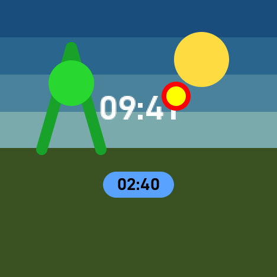
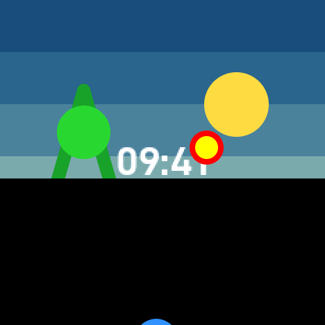
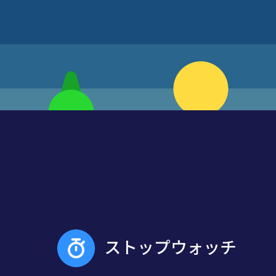

# 10-4 検証記録: 背景復元と一覧の被覆

実施日: 2026-09-26。[10-4計画](plan-10-4.md)の実装、ホスト検証、ビルド、実機の描画検証・描画時間の測定・静止時の測定を終えた。
ユーザーによる実機の目視確認（6節）を経て、**10-4を完了とした**。

多色背景は診断用の文字盤（`test-backdrop`、描画検証版だけに入る）で確かめた。画像は実機の読み戻し（[10-4-shots](10-4-shots/)、作り方は10-3と同じ）。

| 情報あり（風景が上へ移る） | 一覧の遷移途中（一覧背景は黒） | 一覧の遷移途中（一覧背景に色） |
|---|---|---|
|  |  |  |

遷移の2枚は、静止から10フレームかけて差分描画で動かした後の画面。一覧の不透明な背景が行間を覆い、風景は動かず一覧に覆われる。
Digitalの8画面（遷移途中を含む）は10-3の画像と**バイト単位で一致**した（移動の責務を文字盤へ移しても見た目は同じ）。

## 1. 実装の要点

| 場所 | 内容 |
|---|---|
| `ui/rendering/Element.*` | `FramePlan`: 変更した要素の旧・新矩形と`damage(Rect)`の和を画面内へ切り詰め、1つのdamage矩形にする。damageと交差する要素をすべて描画対象にし、damageを広げない。旧来の重なりの連鎖（閉包）を削除。`begin`に画面の矩形、`eraseBox`・`dirtyBounds`は`area()`へ置き換え |
| `ui/rendering/PaintContext.h`（新規） | 描く範囲（damageまたは全画面）と、`within(clip)`によるレイヤーのクリップ。`clip(g,box)`が要素・damage・レイヤーの3者の交差を設定し、空なら何もしない |
| `ui/rendering/Renderer.*` | damageを基底色（`Renderer::Base`＝黒）で復元し、各レイヤーの前にクリップをdamageへ戻す。StatsOverlayはクリップを外してから |
| `RenderLayer::paint`・`WatchFace::paint` | `PaintContext`を受け取る。`WatchFace::plan`は`DrawRegion`でなく`WatchEnvironment`（画面・被覆されていないクリップ・一覧進捗）を受け取る |
| `features/home/HomeLayer.*` | 文字盤の描画を被覆されていないクリップへ狭める |
| `features/home/faces/DigitalWatchFace.*` | 一覧進捗から`-p*height`の移動を自分で適用する |
| `host/FrameComposer.h` | 時計に`WatchEnvironment`を渡し、移動量を決めない。`FrameOrder`はHome→AppListBackground→AppList→各画面→Toast |
| `features/launcher/AppListLayout.h` | `appListTop`・`appListCover`・`appListUncovered`・`appListCoverChange`。一覧の背景・行・時計のクリップが同じ上端を使う。`launcherHomeRegion`を削除 |
| `features/launcher/AppListBackgroundLayer.*`（新規） | 一覧の不透明な背景。要素を登録せず、色の変更（全体）と上端の移動（帯）だけをdamageとして申告する。色は選択中の文字盤の`listBackground()` |
| `ui/list/ListView.*` | 背景色を描画入力に追加。行のfingerprint、文字画像のキーと塗り、直接描画の文字背景に反映。円の縁はパネル上の画素と合成されるため、背景を先に描けば正しくなる |
| 設定・ストップウォッチ・外部詳細・トースト | `context.clip`で描く。ストップウォッチの盤面（背景）は全面再描画の時だけでなく、damageの範囲で毎回描き直す。トーストの出現・消失の全面再描画を廃止（通常の要素の変更として扱える） |
| `ui/graphics/Shapes.*`（新規） | `drawWideLineClipped`。LovyanGFXの`drawWideLine`は2節の問題があるため、同じ距離・しきい値で現在のクリップ内だけを描く自前の実装。Digitalの充電の稲妻で使用 |
| `main.cpp` | `declareReadableFramebuffer`。2画素の書き込みと読み戻しが一致したときだけ、パネルを読み戻し可能と宣言する（2節） |
| `host/RenderDiagnostics.cpp` | `BackdropFace`（空の帯・太陽・木・地面、情報ありで風景が上へ移る。時刻と情報を透過描画し、不変の輪が時刻に重なる。一覧背景の色を変えられる）、一致ケース78件、描画時間の測定、画像 |

判断と計画からの差分:

- **旧方式との切替モードは設けなかった**（計画2節・6節の手順2）。新方式で最初に動かした時点で、既存の405件は全件一致し、失敗は新しい多色背景の8か所だけだった（原因は2節のライブラリの問題）。二つの描画方式を併存させる期間は不要と判断した。
- **帯の申告の責任**: 最初は一覧背景が色によらず上端の帯を申告していたが、黒のときはDigitalの遷移でdamageが144,825→200,969px、描画が12.9→22.1msに増えた。
  「各レイヤーは自分が描く画素の変化だけを申告する」とし、黒の一覧背景（Rendererの基底色と同じ）は何も申告しない。
  背景を持つ文字盤が、自分のクリップの変化した帯を申告する（`WatchFace::plan`の契約に明記。Forestも同じ）。これでdamageは10-3と同じ144,825pxに戻った。
- `FramePlan::shouldPaint`はホストテスト用に残し、各レイヤーは`context.clip`だけで描くかを決める（同じ判定）。
- StatsOverlayは既存の例外（自分の矩形を復元する）のまま。

## 2. 作業中に見つけたライブラリの問題

| 問題 | 症状 | 対策 |
|---|---|---|
| LovyanGFXの`drawWideLine`（`drawSmoothLine`・`drawWedgeLine`も同じ）は、呼び出し側のクリップを**自分の外接矩形で置き換え**（`clampArea`は画面端にしか切り詰めない）、最後に`clearClipRect()`する | damageの外まで線を描き、AAの縁を前フレームの上へ二重に合成する。後続の描画もクリップなしになる。木の周辺で最大3,135画素の不一致（[1回目](20260926-10-4-render-check-1.log)） | クリップの保存・復元だけでは防げなかった（[2回目](20260926-10-4-render-check-2.log)、同じ29件）。自前の`drawWideLineClipped`に置き換えて一致（[3回目](20260926-10-4-render-check-3.log)）。`Gfx.h`に使用禁止を注記 |
| M5GFXは直接描画用パネルの`readable=false`を、PSRAMのフレームバッファ版パネルへそのまま複製する | 実際には読み戻せる（描画検証の`readRect`は動く）が、LovyanGFXの透過文字（`setTextColor(fg)`のみ）は読み戻し不可と判断して**黒と合成**する。多色背景の上で文字の縁が暗くなる（白と背景(74,130,156)の間の画素が(58,61,58)）。差分と全面で同じ結果になるため一致検証では見つからず、画像で見つけた | 起動時に2画素の書き込み・読み戻しを試し、一致したときだけ`readable=true`にする（`[Display] framebuffer readback=yes`）。縁は(156,186,206)など背景との中間色になった。直接描画へ退避した場合は従来どおり |

`isReadable()`を見るのはLovyanGFXの透過文字とPNG/QOIの展開だけで、製品の他の描画には影響しない（Digital・一覧・設定の文字はすべて背景色つき）。

## 3. ホスト検証

全7スイートPASS（[ログ](20260926-10-4-host-2.log)）。変更・追加分（`ui_tests`）:

| 計画7節の項目 | 検証 |
|---|---|
| 差分描画と全面描画の一致 | `repaint`: 3000ケース。縞模様の背景に、動いて色も変わる帯（背景の変化として`damage`で申告）と、移動・変更・消失・重なりのある要素8個。damageが**変更分とちょうど等しい**こと、`shouldPaint`がdamageとの交差に等しいこと、画素の一致 |
| 旧領域のみ／新領域のみ／消失／離れた変更／AA分の外周／空クリップ／容量超過 | `damage`: 各ケースのdamage矩形。画面外の切り詰め、背景の変化だけのフレーム、容量超過で全画面と`-1`の要素 |
| 小さな文字変更が背景と交差してもdamageが全面へ広がらない | `damage`: 全画面大の不変要素の上で数字だけ変わると、damageは数字の矩形のまま（大きな要素はその中で描き直す） |
| PaintContext | 3者の交差、`within`、空のとき`setClipRect`を呼ばない、`restore` |
| 一覧背景 | `appListCoverChange`: 上端の移動は帯、色の変更は全体、変化なしは空 |
| 移動の責務 | `composition`: 41段階で進捗と被覆されていないクリップが渡り、移動量を持たない。時計のクリップの下端＝一覧の背景・行の上端。レイヤー順7つ |

## 4. ビルド

| 構成 | ビルド | `verify_build.py` | イメージ | 静的RAM | SHA-256 |
|---|---|---|---:|---:|---|
| m5stopwatch | SUCCESS | PASS | 1,175,584 | 45,140 | `168c904398a0b92928a43929bbc2d3125bf640ef701a0972cf14c09fed96a9c7` |
| m5stopwatch-measure | SUCCESS | PASS | 1,179,872 | 62,284 | `f270f0ca244d2c4e8072ac55453faafe598727a7648905d8ccca7e31f3570170` |
| m5stopwatch-render-check | SUCCESS | PASS | 1,192,368 | 63,268 | `9adbd841d274aa7ab0d468094a8c55a18e69cf4465a59e4d5a65bb6577377e15` |

ログは`20260926-10-4-build-final-*.log`・`20260926-10-4-verify-final-*.log`。製品版は10-3比でイメージ−144 bytes、静的RAM−56 bytes。4MiB上限に対する余裕は3,018,720 bytes。自作ファイル由来の警告はない。

途中の失敗（記録として残す）: `-build-m5stopwatch-render-check-1`は設定レイヤーの置換漏れ、`-3`は診断コードの`printf`の書式に改行が入ったもの。

## 5. 実機

### 5.1 描画検証

[最終版のログ](20260926-10-4-render-check-final.log): `[Verify] checks=483 mismatches=0 result=PASS`（10-3の405件＋78件）。

- 既存の405件（一覧・設定メニュー・編集画面・外部詳細・ストップウォッチ・トースト・容量超過・復帰・文字盤切替・Digitalの全ケース）が新方式で一致。
  ストップウォッチのトースト出現・消失は、全面再描画でなく差分描画（盤面をdamageの範囲で描き直す）で一致した。
- 追加78件（`test-backdrop`、一覧背景を黒と色0x18c9の2通り）: 分の更新、桁幅が狭くなる更新、情報の出現・ラベル変更・消失（風景の再配置）、トーストの出現・消失、無効時刻、
  一覧進捗0.004／0.02／0.25／0.5／0.75／0.98／0.998／1と、1→0.7→0.3→0.6の途中反転、0.05、0、
  一覧の行（5つの選択と行の間の位置）、文字画像とグリフの比較、一覧上のトースト、半分上げた一覧の下での風景の再配置、
  一覧表示中の背景色の変更（文字画像のキャッシュを含む）、黒への変更と戻し、文字画像の確保失敗と回復、遷移途中の容量超過と回復、遷移途中でのDigitalへの切替。
- ボタン開始とドラッグ開始は、描画には同じ進捗の値として届くため、進捗の値の掃引で代表させた。
- バリアント切替16回・文字盤の切替16回の前後で内部RAMの空きは不変（188,559）。

### 5.2 描画時間と転送範囲

`[Perf]`（操作なしで描画を直接呼んで測定。468×468）。10-3は[10-3検証記録](10-3-validation.md)4節。

| 更新 | 10-3 平均／最大 | 10-4 平均／最大 | 転送範囲（平均px） |
|---|---:|---:|---|
| 変化なし | 0.22 / 0.72ms | 0.20 / 0.70ms | 0 |
| 分（時分） | 2.84 / 3.49ms | 2.80 / 3.51ms | 8,892 |
| 情報ラベルだけ | 3.35 / 3.76ms | 3.37 / 3.77ms | 5,766 |
| 秒（時分秒） | 2.81 / 3.07ms | 2.77 / 3.03ms | 8,892 |
| 秒＋情報ラベル | 7.76 / 7.93ms | **9.82** / 10.02ms | 42,699（同じ） |
| 一覧遷移（Digital、0→1→0） | 12.9 / 20.2ms | **17.7** / 26.4ms | 144,825（同じ） |
| 一覧スクロール（黒） | — | 22.2 / 26.6ms | 155,699 |
| 一覧スクロール（色の背景） | — | 29.0 / 35.0ms | 155,669 |
| 多色背景の分の更新 | — | 5.9 / 6.9ms | 11,893 |
| 多色背景の一覧遷移（色／黒） | — | 16.3 / 33.6ms、13.1 / 28.7ms | 96,555 |

- 基底色の復元（全画面219,024px）は**9.04ms**（転送を含まない。1画素あたり41ns、PSRAMのフレームバッファへの書き込み）。
- 転送範囲が同じなのに時間が増えた2件は、damage全体の復元による。従来は変更した要素の旧矩形だけを黒で消し、要素の間の画素には触れなかった。
  遷移の増加（+4.8ms）は約145,000pxの復元と一致する。すべて33.3ms以内。
- 一覧スクロール（黒）は9-5の測定版（21.6〜23.6ms）と同程度。既存の「定常33.3ms以内」の未達は変わらない。
- 色の一覧背景はdamageを2回塗るため約7ms増え、最大35.0msになる。両文字盤の初期値は黒（計画3.1節）で、製品では発生しない。
- 改善候補（本作業の範囲外）: 複数矩形のdamage（計画1節で必須範囲外とした）、基底色の復元の高速化。

### 5.3 静止時（測定版、[ログ](20260926-10-4-measure-idle.log)）

| 項目 | 10-3 | 10-4 |
|---|---:|---:|
| `stack_free` | 5,412 | 5,420 |
| 内部RAM空き／最大連続 | 186,147 / 135,168 | 186,203 / 135,168 |
| 静止60秒窓 | `paints=0` | `paints=0`、`loops=61` |

描画検証版の`stack_free=3,892`は、検証関数が同じタスクで深く動くためで、製品の値ではない。

## 6. 実機での目視確認（2026-09-26、ユーザー確認済み）

製品版を導入済み（[ログ](20260926-10-4-install-product.log)）。

- [x] 時計（Digital）の見た目が10-3と同じ。黒い矩形や縁の残りがない。充電中の稲妻（USB接続時）が以前と同じに見える。
- [x] 上スワイプ・A/B・APPSのタップで一覧が開く遷移が以前と同じ。途中で指を戻す（途中反転）・下スワイプで戻る遷移で崩れない。
- [x] 一覧のスクロール、設定メニュー・編集画面・保存時のトースト、ストップウォッチ、外部アプリ詳細に表示の崩れがない。
- [x] ストップウォッチ計測中にホームへ戻り、チップが毎秒進む間も崩れない。

## 7. 全体計画への補足候補（10-6で反映）

- 背景復元は全paintのクリップ規約の変更を伴う。damageは1つの外接矩形で、その中を基底色で復元してから背面から描き直す。
- 各レイヤーは自分が描く画素の変化だけをdamageとして申告する。基底色と同じ背景は申告しない。背景を持つ文字盤は、一覧の上端が動いた帯を自分で申告する。
- LovyanGFXの`drawWideLine`系はクリップを壊すため使わない（`drawWideLineClipped`）。フレームバッファ版パネルは読み戻し可能と宣言しないと、透過文字が黒と合成される。
- damage全体の復元の費用（全画面9ms）。転送範囲が同じでも、要素の間の画素を復元する分だけ遅くなる。
