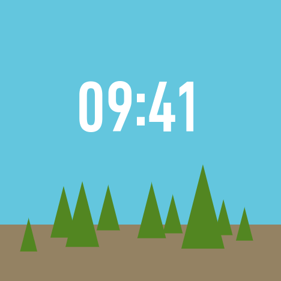
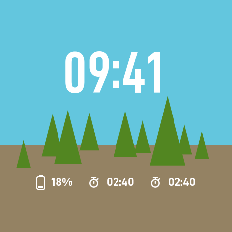
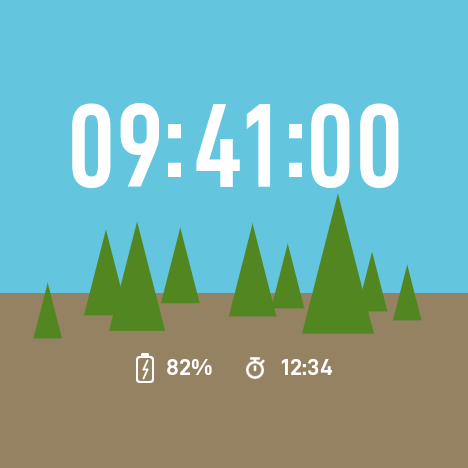
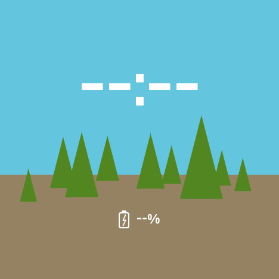
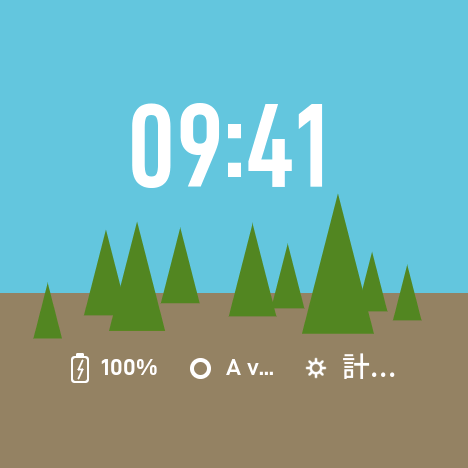
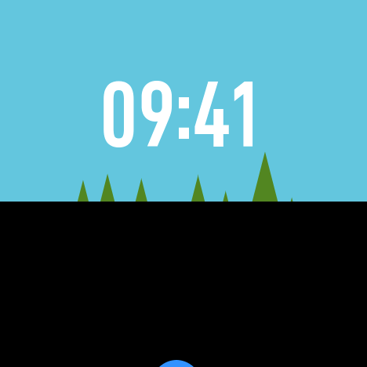

# 10-5 検証記録: Forest・文字盤選択・永続化

実施日: 2026-09-26。[10-5計画](plan-10-5.md)の実装、ホスト検証、ビルド、実機の描画検証・描画時間・静止時の測定を終えた。
**ユーザーによる実機の確認（6節）が済めば10-5を完了とする。**

画像は実機の読み戻し（[10-5-shots](10-5-shots/)、作り方は10-3と同じ）。

| 通常 | 情報あり（電池18%・2件） | 秒表示＋充電中＋1件 |
|---|---|---|
|  |  |  |
| **無効時刻・電池不明で充電中** | **長いラベル・日本語・汎用アイコン・100%充電中** | **一覧遷移の途中** |
|  |  |  |

Digitalの8画面と多色背景の3画面は、時刻描画を共通化した後も10-3・10-4の画像と**バイト単位で一致**した。

## 1. 実装の要点

| 場所 | 内容 |
|---|---|
| `storage/WatchPreferences.*`（新規） | 選択（`watch_sel`: 形式1・長さ・ID最大31bytes）と文字盤ごとのレコード（形式1・長さ・payload最大64bytes）。結果はOk／Missing／Invalid／Unavailable／WriteFailed／TooLarge。`FacePreferences`は1つのキーだけに束縛された窓口 |
| `storage/NvsBackend.*` | 同じ名前空間`launcher`にキー別のblobを読み書き（`RecordBackend`）。設定レコード`config`は変更なし。NVSの消去はしない |
| `features/home/FaceSelection.h`（新規、純粋） | 文字盤の登録（IDとキーの検証・重複・予約キー`config`・`watch_sel`の拒否、最大4）、起動時の復元、選択の確定（開始→成功時だけ保存、同じ文字盤は何もしない、保存失敗は表示を維持して次回再試行） |
| `features/home/VariantRecord.h`（新規） | 時分／時分秒の保存（版1＋1byte）。未知版・不正値は既定値で書き戻さない。同値は書かない。失敗後は次の変更で再試行 |
| `features/home/faces/TimeGroups.h`・`TimeDigits.*`（新規） | 時刻の桁組みの配置、計測・キャッシュ・描画をDigitalとForestで共用。Digitalはこれに載せ替えた（画像一致） |
| `features/home/faces/ForestLayout.h`（新規、純粋） | 風景（空・地面・木9本）の幾何、時刻と情報欄の配置、電池の表示条件、`ForestControl`（バリアント・電池・レイアウト・期限・タップは無視） |
| `features/home/faces/ForestWatchFace.*`（新規） | 背景をdamageの範囲で図形から描き直す。時刻は空色、情報欄は地面色の上に不透明に描く。アイコンは白。風景の移動と一覧の上端の帯をdamageとして申告 |
| `ui/graphics/Shapes.*` | `fillSmoothTriangleClipped`（クリップ内だけに描くAA付き三角形。画素の被覆は画素だけで決まり、クリップに依存しない。完全に覆われる部分は行ごとに塗りつぶし） |
| `ui/rendering/Renderer.*`・`WatchFace::opaqueArea` | 最背面レイヤーが自分の色で覆う範囲には基底の黒を塗らない（Forestの全面描画41.9→33.0ms） |
| `features/home/HomeLayer.*`・`host/HostRenderer.*` | Digital・Forestの登録、起動時の復元、設定からの選択。開始失敗時は前の文字盤、それも無理ならDigitalの非キャッシュ描画 |
| `features/settings/*` | 設定トップに「文字盤  <表示中の名前>」、選択画面（Digital／Forest／戻る、表示中に「使用中」）。Aで移動、B／タップで確定してその場で適用・保存、画面に留まる |
| `host/ScreenManager.*` | 文字盤の保存失敗（`HomeOutcome::saveFailed`）を「保存に失敗しました」で通知 |
| `hal/M5Hal.cpp`・`power/PowerManager.h`・`HomeModel.h` | 充電状態の有効性（`charge_unknown`を非充電と区別）。`HostRuntime`がUSB給電の変化で電池を読み直す（1秒周期の既存取得を利用、新しい周期処理なし） |
| `main.cpp` | ストレージを描画の初期化より前に準備。描画検証版は保存を束縛しない（検証中の切替を残さない） |
| 日本語フォント | 「盤・使・用」を収録して再生成（350字、177,738 bytes） |

表示の決定:

| 項目 | 内容 |
|---|---|
| 色 | 参考画像から採取: 空(96,196,218)=0x663B、地面(147,128,98)=0x940C、木(85,135,34)=0x5424、文字とアイコンは白 |
| 木 | 参考画像の輪郭から9本の三角形（頂点・底辺）を実測。斜辺は横1pxにつき3.9px下がる |
| 情報あり | 風景を80px、時刻を32px上へ（参考画像どおり） |
| 時刻 | Condensed SemiBold 120px（確定済み）。縦位置は参考画像の数字の中心（177.5／145.5）に合わせた。参考画像の数字（高さ72px）より大きい（85px）。**要目視** |
| コロン | 数字の中心より15px低い。Digitalの「11.5pxのうち8px」の比率で**10px上げた暫定値**。参考画像は上げていない。**要目視** |
| 情報欄 | 中心367、アイコン28px、電池18×30px、アイコンと文字の間12px、グループ間28px、22pxの文字（参考画像は約19px） |
| 情報欄の幅 | 円の弦から左右12pxを除いた幅。狭いグループの余りを広いグループへ回し、行全体に入らないときだけ均等に分けて省略する |

判断と計画からの差分:

- 時刻が常に空の上、情報欄が常に地面の上にあることをホストテストで確認したので、どちらも背景色つきで不透明に描き、キャッシュとの一致を保った（木との合成が要らない配置）。
- 計画の`HomeControlPort`拡張は、descriptor列挙を`faceCount`・`faceAt`・`currentFace`・`chooseFace`で実現した。descriptorのストレージキーはホスト内（`FaceSelection`）だけが持ち、設定画面には渡さない。
- 描画検証版では保存を束縛しない（検証がバリアントや文字盤を何度も切り替えるため）。保存の経路はホストテストで確認した。

## 2. ホスト検証

全8スイートPASS（[ログ](20260926-10-5-host-3.log)）。`watchface_tests`（新規）:

| 計画7節の項目 | 検証 |
|---|---|
| ストレージ分離、最大長、容量超過、未知ID・未知版、壊れた長さ、save失敗 | `records`・`separation`: 形式のバイト列、ID31bytesまで、64bytesまで、超過は書く前に拒否、未知形式・長さ不一致・過大は変更せずInvalid、読めない・書けない。文字盤ごとのキーの分離、設定レコードが文字盤の書き込み後も同じで読み直せる、予約キー・重複の登録拒否、最大4件 |
| 同値抑止、失敗後再試行、未知版で書き戻さない | `variants`: Digital・Forestのバリアントの保存と復元、同値は書かない、失敗しても表示は変わり`saveFailed`、次の変更で再試行、保存しない文字盤も動く |
| 選択・復元、begin失敗、保存失敗 | `selection`: 未保存・未知・破損・読めない→最初の文字盤で書き込みなし、選択で保存、同じ選択は何もしない、開始失敗は前のまま保存なし、保存失敗は表示して次回起動は最後に保存した文字盤、再試行 |
| 29／30／31%、充電、取得失敗 | `forestBattery`: 境界、充電中は常に表示、残量不明・充電状態不明の扱い、同じ入力で状態が進まない、情報2件まで |
| 風景配置 | `forestLayoutRules`: 466・468pxの両方で、時刻の枠は円の中・地面より上・木の頂点より上、情報欄は円の中・木の底辺より下、風景の80px移動、木の傾き、グループ幅の配分 |
| 候補一覧・選択・戻る・ホーム | `settingsFaces`: 文字盤行のラベル、選択画面の行、カーソル移動では選ばない、B・タップで選択して留まる、失敗の通知、戻るで同じ行、ホーム、再訪は先頭、文字盤なしでも戻れる、長押しの保存失敗の通知 |

既存テストの変更: 設定メニューが6行になった行位置、USB給電の変化で電池を読み直して再描画すること（従来は再描画しない前提）。

## 3. ビルド

| 構成 | ビルド | `verify_build.py` | イメージ | 静的RAM | SHA-256 |
|---|---|---|---:|---:|---|
| m5stopwatch | SUCCESS | PASS | 1,223,680 | 51,604 | `f50d53188a9ffd771b08e5bf0f393789dff294a7c28d91e794bbd53356beb2d8` |
| m5stopwatch-measure | SUCCESS | PASS | 1,227,936 | 68,732 | `06ca25e7233206e43f6558f1aa09badea2d2b69570a19b52f75017dff52f42b6` |
| m5stopwatch-render-check | SUCCESS | PASS | 1,248,800 | 70,068 | `d47cd61a5eb239fad23e3be75bda6671d90fd1a492de7b9b1d7790dea15da7f3` |

製品版は10-4比でイメージ+48,096 bytes（4MiB上限に対する余裕2,970,624 bytes）、静的RAM+6,464 bytes（Forestの文字盤オブジェクトとアイコンのマスクなど）。
製品版の1回目（`-build-final-m5stopwatch`）はESP-IDFの構成段階で`component_requires.temp.cmake`が見つからず失敗し、再実行で成功した（環境要因。ログを残す）。
描画検証版の1回目（`-build-m5stopwatch-render-check-1`）は型の不一致と`snprintf`の重なりの警告。

## 4. 実機

### 4.1 描画検証

[画像つきの版のログ](20260926-10-5-render-shots-2.log): `[Verify] checks=548 mismatches=0 result=PASS`（10-4の483件＋65件）。

- Forest: 分の更新、桁幅、電池31→30→29→5→0→100→不明→30、充電、充電中で残量不明、充電状態不明、情報1・2件、電池＋2件、ラベル・アイコン・未知ID・汎用アイコン・長いラベル・日本語、トースト、情報の削除、
  秒表示の秒・分・時の境界、秒表示＋情報、無効時刻、一覧進捗の掃引と途中反転、半分上げた一覧の下での風景の移動、容量超過、キャッシュと直接描画（通常・情報あり・秒表示）、Digitalへの切替。
- 推奨色だけの変更では何も描かない（転送範囲が空）ことを確認した。
- 文字盤とバリアントの切替16回の前後で内部RAMの空きは不変（175,627）。

### 4.2 描画時間と転送範囲（`[Perf]`、468×468）

| 更新 | Forest 平均／最大 | 転送範囲（平均px） | Digital 平均（参考） |
|---|---:|---|---:|
| 分（時分） | 2.91 / 3.35ms | 9,078 | 2.96ms |
| 情報ラベルだけ | 1.96 / 2.21ms | 3,404 | 3.38ms |
| 秒（時分秒） | 2.94 / 3.12ms | 9,078 | 2.89ms |
| 秒＋情報ラベル | 16.2 / 16.3ms | 63,242 | 9.76ms |
| 一覧遷移（0→1→0、情報1件） | 11.4 / 25.3ms | 99,068 | 17.7ms |
| 全面描画 | **33.0** / 33.0ms | 219,024 | 25.7ms |

- Forestの全面描画は、最背面の不透明範囲で基底の黒を塗らないようにして41.9→33.0msになった。33.3msは下回るが余裕は小さい（空と地面の塗り約9ms、木、転送）。全面描画は復帰・文字盤切替・画面切替のときだけ。
- 秒＋情報ラベルは、秒の枠と情報欄を囲む1つの矩形（63,242px）の中で風景を描き直すため遅い。

### 4.3 静止時（測定版、[ログ](20260926-10-5-measure-idle.log)、Forest表示）

| 項目 | 10-4（Digital） | 10-5（Forest） |
|---|---:|---:|
| `stack_free` | 5,420 | 5,140 |
| 内部RAM空き／最大連続 | 186,203 / 135,168 | 176,923 / 126,976 |
| 静止60秒窓 | `paints=0`、`loops=61` | `paints=0`、`loops=61` |

内部RAMの減少（約9.3KB）は静的RAMの増加（6.5KB）とForestの時刻キャッシュ（61,410 bytes、Digitalは59,584）。

### 4.4 保存と復元

製品版の起動ログ（[ログ](20260926-10-5-boot-product.log)）で`[WatchFace] stored selection=ok id=forest`、既存設定`[Settings] ... stored=ok`。
保存を有効にした版を最初に入れたのは測定版で、その起動では選択は未保存（Digital）だったはずだが、次の起動でforestが保存されていた。導入直後に実機で選ばれたのか、6節の確認で確かめる。

## 5. 未実施（10-6へ）

- 電力（Forest・秒表示・情報表示の比較）、一覧遷移・スクロールの実操作での測定。
- 保存失敗・キャッシュ確保失敗の実機での再現（ホストテストと直接描画の一致で代替）。

## 6. 実機での確認（ユーザー確認待ち）

製品版を導入済み（[ログ](20260926-10-5-install-product.log)）。

- [ ] 設定の「文字盤」でDigital／Forestを切り替えられ、「使用中」が移る。戻るで設定トップへ戻る。
- [ ] 再起動（電源の入れ直し）後も選んだ文字盤と、長押しで選んだ時分／時分秒が残る。輝度・消灯時間も残る。
- [ ] Forestの見た目（空・地面・木、時刻のサイズ、コロンの高さ）。
- [ ] Forestで電池（30%未満または充電中）・ストップウォッチ計測中の情報欄が出ると風景が上へ移り、消えると戻る。
- [ ] Forestで上スワイプ・A/Bの一覧遷移、タップで何も起きないこと。

## 7. 全体計画への補足候補（10-6で反映）

- 永続化は設定レコードと別のレコード（選択`watch_sel`、文字盤ごと`wf_*`）。文字盤は自分のキーだけの窓口を受け取る。
- 選択画面は決定で即適用・保存し、画面に留まる。保存失敗は表示を維持して通知し、同じ選択で保存だけ再試行する。
- 充電状態の有効性（`charge_unknown`は非充電ではない）と、USB給電の変化での電池の読み直し。
- 最背面レイヤーの不透明範囲では基底の黒を塗らない（背景を持つ文字盤の全面描画の短縮）。
